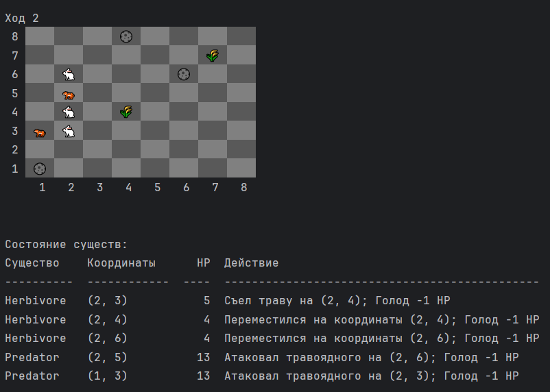
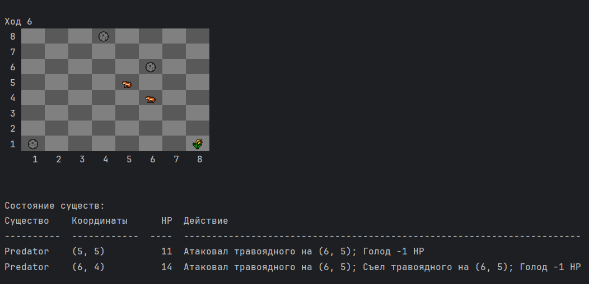

Подготовлю обновленный README.md:

```markdown
# Симуляция Жизни


Проект основан на идее из [Python Backend Learning Course](https://zhukovsd.github.io/python-backend-learning-course/projects/simulation/) от Сергея Жукова.

## Описание
Симуляция жизни на шахматной доске, где травоядные ищут траву, хищники охотятся на травоядных, а все существа борются за выживание.

## Особенности
- 🌿 Автоматическое появление травы
- 🐇 Травоядные ищут и едят траву
- 🐅 Хищники охотятся на травоядных
- 🎮 Интерактивное управление симуляцией
- 📊 Статистика популяций
- 🎨 Цветной консольный интерфейс

## Скриншоты
### Начало симуляции


### Процесс симуляции



## Установка

### Требования
- Python 3.8+
- pip

### Шаги установки
1. Клонируйте репозиторий:
```bash
git clone https://github.com/Grafstain/SimulationFromChess.git
cd simulation-life
```

2. Создайте виртуальное окружение:
```bash
python -m venv venv
source venv/bin/activate  # Linux/MacOS
venv\Scripts\activate     # Windows
```

3. Установите зависимости:
```bash
pip install -r requirements.txt
```

## Запуск

### Запуск симуляции
```bash
python main.py
```

### Запуск тестов
```bash
pytest
```

## Управление
- `ПРОБЕЛ` - пауза/продолжить
- `Q` - выход из симуляции

## Правила симуляции

### Существа
1. **Травоядные** (🐇)
   - Ищут ближайшую траву
   - Теряют здоровье каждый ход
   - Восстанавливают здоровье, съедая траву

2. **Хищники** (🐅)
   - Охотятся на травоядных
   - Теряют здоровье каждый ход
   - Восстанавливают здоровье при успешной охоте

3. **Трава** (🌿)
   - Появляется автоматически
   - Служит пищей для травоядных

4. **Камни** (🌑)
   - Статические препятствия
   - Блокируют движение

### Механики
- Каждое существо может двигаться на одну клетку за ход
- Существа теряют здоровье каждый ход
- При достижении 0 здоровья существо погибает
- Новая трава появляется с заданной вероятностью

## Структура проекта
```
simulation-life/
├── src/
│   └── simulation_from_chess/
│       ├── actions/         # Действия симуляции
│       ├── core/            # Ядро симуляции
│       ├── entities/        # Существа и объекты
│       ├── renderers/       # Рендеринг
│       └── utils/           # Утилиты
├── tests/                   # Тесты
├── docs/                    # Документация
│   └── images/             # Скриншоты
├── main.py                 # Точка входа
└── README.md
```

## Разработка

### Запуск тестов с покрытием
```bash
pytest --cov=src.simulation_from_chess --cov-report=html
```

## Благодарности
- [Сергей Жуков](https://github.com/zhukovsd) - автор оригинальной идеи и курса
- [Python Backend Learning Course](https://zhukovsd.github.io/python-backend-learning-course/)
```

Примечания:
1. Создайте директорию `docs/images/` для скриншотов
2. Добавьте актуальные скриншоты и GIF симуляции
3. Обновите ссылку на ваш репозиторий
4. Создайте файл requirements.txt с зависимостями
5. При необходимости добавьте дополнительные разделы
